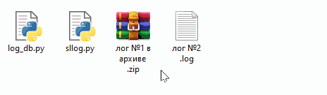

# Чтение лог файлов сигнализаций StarLine

StarLine ограничивает возможности смотреть логи непрофессиональным установщикам.
Если вы считаете себя достаточно квалифицированным специалистом, то эта программа вам пригодится. 


## Как пользоваться

1. Лог необходимо выгрузить кнопкой <kbd></kbd> - "Выгрузить лог"
в программе StarLine Master.

   Если вы выгрузили его командой LOGLOAD, то он будет отправлен на сервер StarLine и вы не сможете его посмотреть.

   Также имейте в виду, что повторная выгрузка сохранит только новые записи с момента предыдущей выгрузки. 

2. Далее выгруженный файл можно отправить боту [@sllogbot](https://t.me/sllogbot) 

   или

   Установить [Python 3](https://www.python.org/downloads/), скачать скрипты и запустить раскодирование у себя на компьютере
   > 

## Что есть в логах
- напряжение аккумулятора
- температура салона/двигателя
- заряд батарейки метки
- уровень сигнала
- состояние дверей, датчиков, педалей, кнопок итп.
- причины запуска/не запуска двигателя
- многое другое...


## Чего в логах нет
- измерений просадки напряжения аккумулятора в момент кручения стартера
- многого другого...


## Дополнительно

```slconfig.py``` - распаковка/упаковка файлов настроек StarLine
